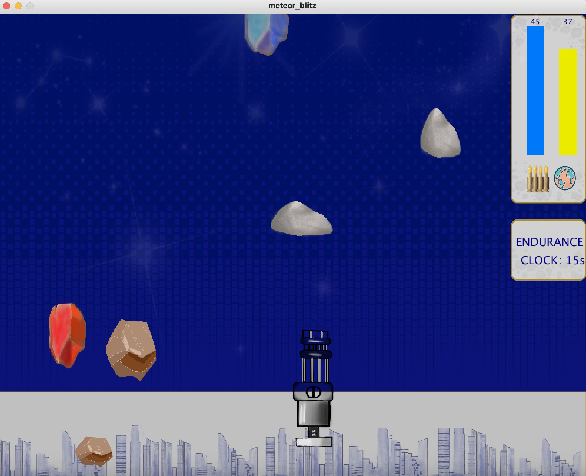

# Meteor Blitz

## Getting Started

Install Processing 3 and open meteor_blitz.pyde in meteor_blitz folder.
Ensure Processing 3 is opened with python.
Source code can be viewed in source_code.py file. 

## Demo Images
&nbsp;

&nbsp;
